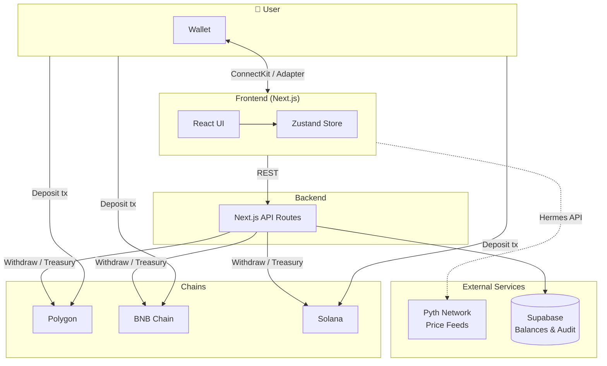
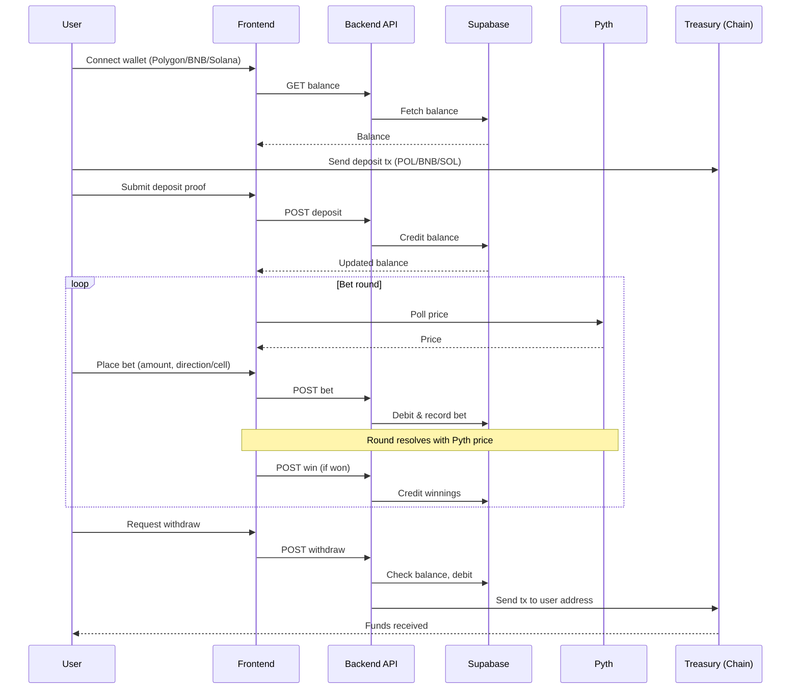
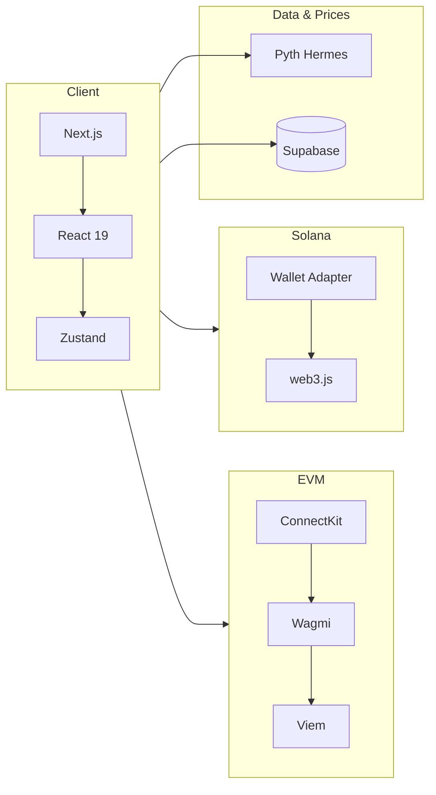
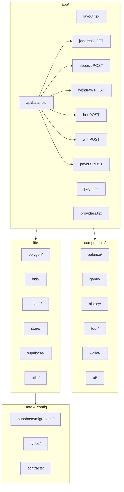
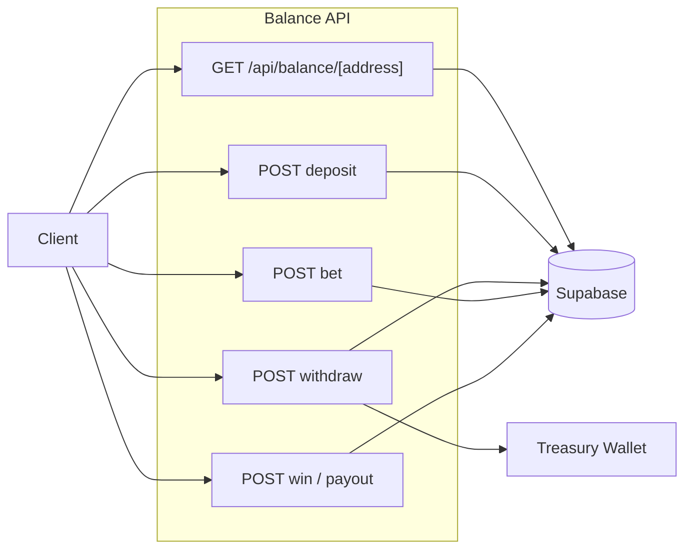

# Polynomo

**Real-time binary options / price prediction dApp — Polygon**

**Powered by** Pyth Network price feeds, Supabase (off-chain state), and multi-chain wallets. Trade on POL, BNB, or SOL with a single house balance and instant resolution.

| Link | URL |
|------|-----|
| **Live app** | [polynomo.vercel.app](https://polynomo.vercel.app/) |
| **Pitch deck** | [Google Slides](https://docs.google.com/presentation/d/1oQ4SYGiB13yIv_4OXgAeuHIQbVPrgQGJKCBppa8C1C4/edit?usp=sharing) |
| **GitHub** | [Polynomo](https://github.com/AmaanSayyad/Polynomo) |
| **Demo Video** | [Demo](https://youtu.be/QbMFgvtc_-E)
---

## Problem

Real-time prediction and binary options in Web3 need **strong security** (deposits/withdrawals) and **low latency** (rounds, UX). Many chains struggle with both. Users want instant bets without signing every trade; they also want funds secured on-chain.

### Solution

- **Polygon (primary)** — Deposit/withdraw POL; ConnectKit (MetaMask, WalletConnect). Default asset chart: POL/USD.
- **BNB Chain** — Deposit/withdraw BNB; same ConnectKit flow.
- **Solana** — Deposit/withdraw SOL; Phantom, Solflare, etc.
- **Pyth Network** — Live prices for POL, BNB, BTC, ETH, SOL, and more (see [Price Feeds](#price-feeds)).
- **House balance** — One balance per user (Supabase); deposit once, bet many times without signing each bet.
- **Classic mode** — Predict Higher or Lower over 5s–1m; multiplier by timeframe.
- **Box mode** — Bet on grid cells; win when the price line crosses your cell.
- **Blitz rounds** — Time-limited 2× multiplier rounds.

---

## Competitive landscape

| Dimension | Polynomo | Typical Web3 prediction / binary apps |
|-----------|----------|--------------------------------------|
| **Chains** | Polygon (primary), BNB, Solana — one app, one house balance | Usually single-chain (e.g. Ethereum or one L2) |
| **Bet UX** | House balance: deposit once, bet many times; no per-bet wallet signature | Often sign every trade (wallet popup per bet) or fully on-chain tx per round |
| **Prices** | Pyth Network (institutional-grade, multi-asset: crypto, forex, stocks) | Chainlink, custom oracles, or CEX-based; often crypto-only |
| **Settlement** | Instant resolution off-chain; deposits/withdrawals on-chain | Varies: full on-chain (slow, costly) or hybrid like us |
| **Game modes** | Classic (higher/lower), Box (grid cells), Blitz (2× rounds) | Mostly simple up/down or single-game focus |
| **Custody** | Treasury wallet per chain (simple, fast); optional future upgrade to escrow contracts | Escrow smart contracts (more trust, more gas) or fully custodial |

**Summary** — Polynomo focuses on **multi-chain UX** (POL, BNB, SOL in one place), **no per-bet signing** (house balance), and **Pyth-powered** resolution across crypto and traditional assets. Competing products tend to be single-chain, require a signature per bet, or rely on less diverse price feeds.

---

## How it works

1. **Connect** — Choose Polygon (primary), BNB, or Solana and connect your wallet.
2. **Deposit** — Send POL, BNB, or SOL to the app’s treasury address; house balance updates via API.
3. **Bet** — Select amount and direction (or cell); resolution uses Pyth prices. No per-bet wallet signature.
4. **Withdraw** — Request withdrawal; backend sends funds from the treasury wallet to your address (2% fee).

Treasury is a **wallet address** (not a smart contract) per chain: you send funds to it for deposits; the server uses the treasury private key to send funds on withdrawals.

### Architecture overview



### User flow



---

## Tech stack

| Layer | Technology |
|-------|------------|
| **Frontend** | Next.js, React 19, TypeScript, Tailwind, Zustand |
| **EVM (Polygon, BNB)** | ConnectKit, Wagmi, Viem; Polygon mainnet + BNB Chain |
| **Solana** | @solana/wallet-adapter, @solana/web3.js |
| **Prices** | Pyth Network (Hermes API); POL, BNB, BTC, ETH, SOL, forex, stocks, etc. |
| **Backend** | Next.js API routes, Supabase (PostgreSQL) for balances and audit |
| **Charts** | Custom LiveChart with asset switcher and grid/classic modes |

### System components



---

## Price feeds

Prices come from [Pyth Network](https://pyth.network). Supported assets include:

- **Crypto:** POL, BNB, BTC, ETH, SOL, TRX, XRP, DOGE, ADA, BCH  
- **Metals:** GOLD, SILVER  
- **Forex:** EUR, GBP, JPY, AUD, CAD  
- **Stocks:** AAPL, GOOGL, AMZN, MSFT, NVDA, TSLA, META, NFLX  

POL/USD feed ID: `0xffd11c5a1cfd42f80afb2df4d9f264c15f956d68153335374ec10722edd70472` ([Pyth Insights](https://insights.pyth.network/price-feeds?search=pol)).

---

## Getting started

### Prerequisites

- Node.js 18+
- A wallet (MetaMask, Phantom, etc.) on Polygon, BNB, or Solana as needed

### 1. Install dependencies

```bash
npm install --legacy-peer-deps
```

### 2. Environment variables

```bash
cp .env.example .env
```

Configure in `.env`:

| Variable | Description |
|----------|-------------|
| `NEXT_PUBLIC_SUPABASE_URL` | Supabase project URL |
| `NEXT_PUBLIC_SUPABASE_ANON_KEY` | Supabase anon key |
| `NEXT_PUBLIC_WALLETCONNECT_PROJECT_ID` | WalletConnect project ID (ConnectKit) |
| **Polygon (primary)** | |
| `NEXT_PUBLIC_POLYGON_RPC_URL` | Optional; default `https://polygon-rpc.com` (client) |
| `POLYGON_RPC_URL` | Optional; server-side RPC for withdrawals (falls back to public URL if unset) |
| `NEXT_PUBLIC_POLYGON_TREASURY_ADDRESS` | Treasury wallet address (receives deposits) |
| `POLYGON_TREASURY_SECRET_KEY` | Treasury private key (server-only; for withdrawals) |
| **BNB** | |
| `NEXT_PUBLIC_BNB_NETWORK` | `mainnet` or `testnet` |
| `NEXT_PUBLIC_BNB_RPC_ENDPOINT` | BNB RPC URL |
| `NEXT_PUBLIC_TREASURY_ADDRESS` | BNB treasury address |
| `BNB_TREASURY_SECRET_KEY` | BNB treasury private key (server-only) |
| **Solana** | |
| `NEXT_PUBLIC_SOLANA_NETWORK` | e.g. `mainnet-beta` |
| `NEXT_PUBLIC_SOL_TREASURY_ADDRESS` | Solana treasury address |
| `SOL_TREASURY_SECRET_KEY` | Solana treasury secret (server-only) |
| **App** | |
| `NEXT_PUBLIC_APP_NAME` | Display name (default `Polynomo`) |
| `NEXT_PUBLIC_ROUND_DURATION` | Round duration in seconds (default `30`) |
| `NEXT_PUBLIC_PRICE_UPDATE_INTERVAL` | Price poll interval in ms (default `1000`) |
| `NEXT_PUBLIC_CHART_TIME_WINDOW` | Chart window in ms (default `300000`) |

### 3. Supabase

1. Create a project at [supabase.com](https://supabase.com).
2. Run the SQL migrations in `supabase/migrations/` (e.g. in the SQL Editor).
3. Set `NEXT_PUBLIC_SUPABASE_URL` and `NEXT_PUBLIC_SUPABASE_ANON_KEY` in `.env`.

### 4. Run the app

```bash
npm run dev
```

Open [http://localhost:3000](http://localhost:3000).

---

## Project structure



```
Polynomo/
├── app/
│   ├── api/balance/          # Balance and bet API routes
│   │   ├── [address]/        # GET balance
│   │   ├── deposit/          # POST deposit
│   │   ├── withdraw/         # POST withdraw (POL/BNB/SOL)
│   │   ├── bet/              # POST place bet
│   │   ├── win/              # POST payout
│   │   └── payout/           # POST payout (alias)
│   ├── layout.tsx
│   ├── page.tsx
│   └── providers.tsx        # ConnectKit, Solana, Zustand
├── components/
│   ├── balance/              # BalanceDisplay, DepositModal, WithdrawModal
│   ├── game/                 # GameBoard, LiveChart, BetControls, ActiveRound
│   ├── history/              # BetHistory, BetCard, MiniHistory
│   ├── tour/                 # QuickTour
│   ├── wallet/               # WalletConnect, WalletDiscoveryModal, WalletInfo
│   └── ui/                   # Modal, Button, Toast, etc.
├── lib/
│   ├── bnb/                  # Wagmi config, BNB config, wallet sync, backend client
│   ├── polygon/              # Polygon config, client, backend client (withdrawals)
│   ├── solana/               # Solana config, client, wallet, backend client
│   ├── store/                # Zustand slices (wallet, game, balance, history)
│   ├── supabase/             # Supabase client
│   └── utils/                # priceFeed (Pyth), fetch, formatters, errors
├── supabase/migrations/      # SQL migrations
├── types/                    # game, bet, flow
├── contracts/                # Optional Solidity (PolynomoTreasury, BinomoTreasury)
├── .env.example
└── README.md
```

---

## API overview



| Method | Path | Purpose |
|--------|------|---------|
| GET | `/api/balance/[address]` | Get house balance for address |
| POST | `/api/balance/deposit` | Credit balance after user deposit tx |
| POST | `/api/balance/withdraw` | Debit balance and send POL/BNB/SOL to user |
| POST | `/api/balance/bet` | Deduct balance and place bet |
| POST | `/api/balance/win` | Credit winnings |
| POST | `/api/balance/payout` | Payout (alias for win) |

Request bodies use `userAddress`, `amount`, and for withdraw `network` (`POLYGON` \| `BNB`). Withdraw defaults to Polygon when `network` is omitted for EVM addresses.

---

## Testing

```bash
npm test
npm run test:coverage
```

---

## Security notes

- **Treasury keys** — `*_TREASURY_SECRET_KEY` and `SOL_TREASURY_SECRET_KEY` must stay server-side only. Never commit `.env` or expose these keys.
- **Supabase** — Use RLS and restrict anon key usage. Balance updates use stored procedures and audit logging.
- **Withdrawals** — Backend validates balance in Supabase and applies a 2% fee before sending from the treasury wallet.
